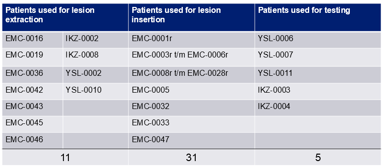
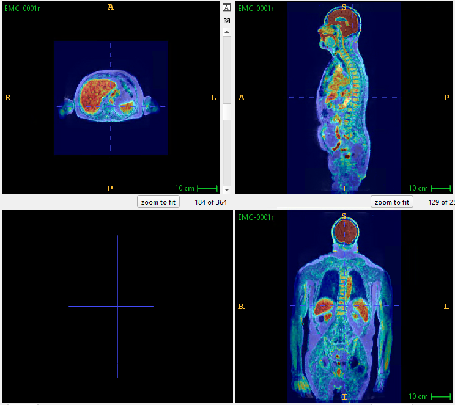
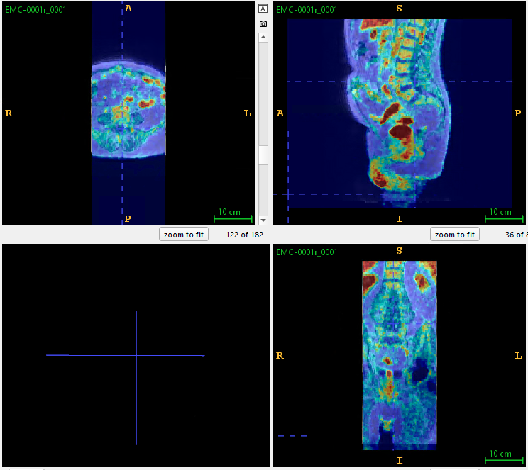
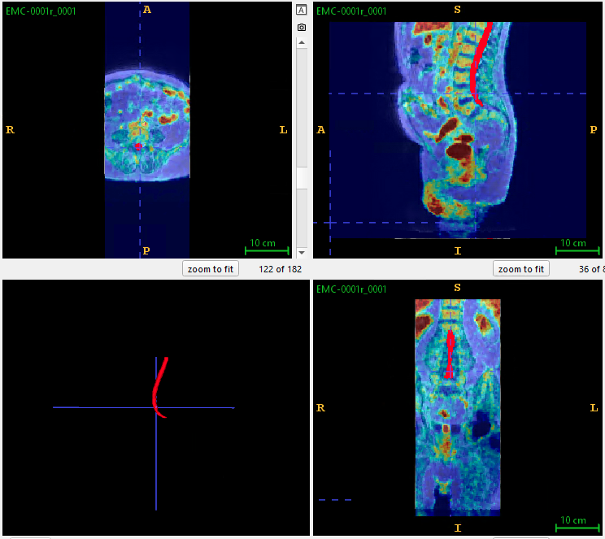
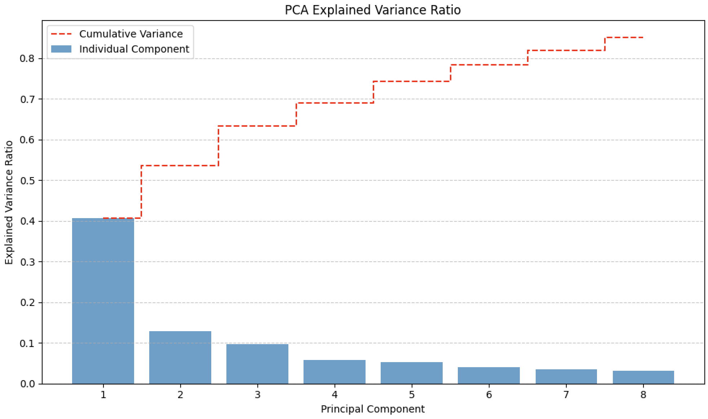
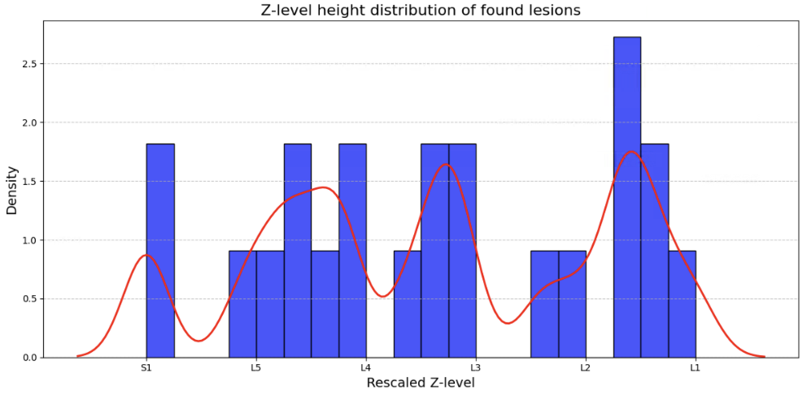
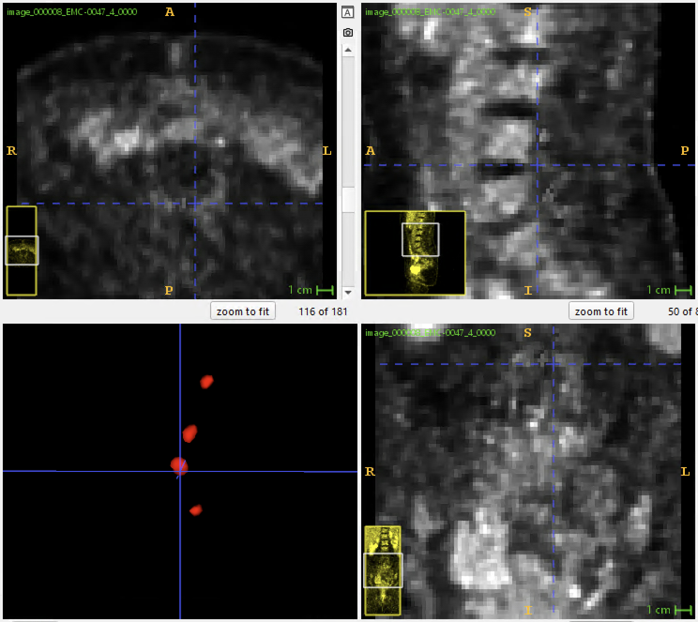
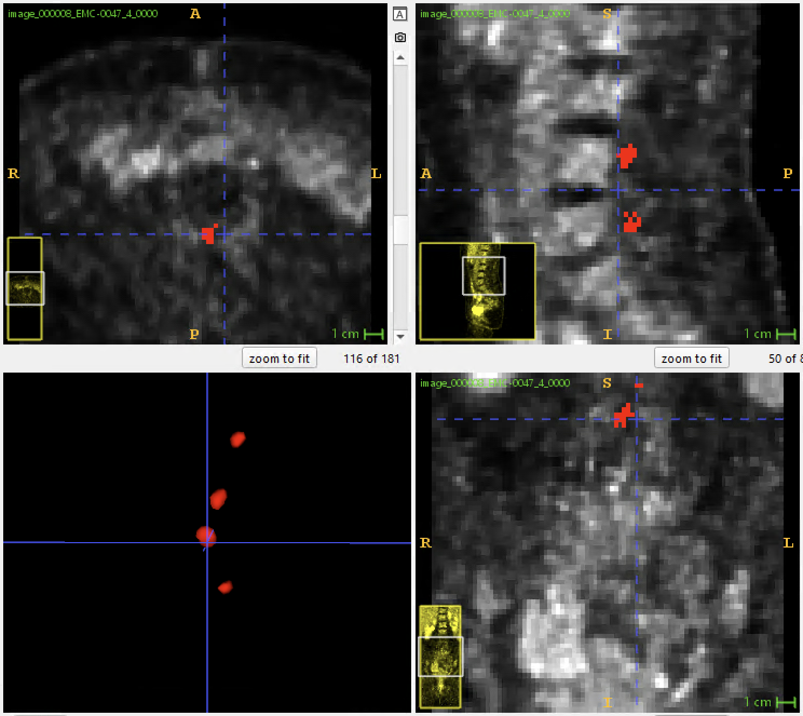
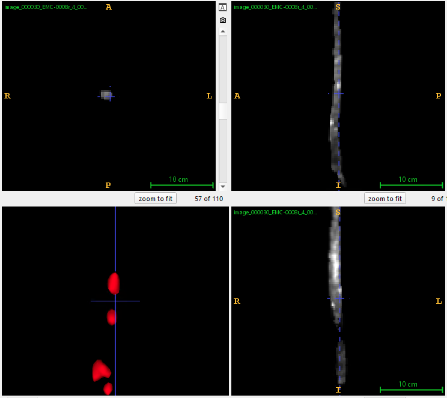

# Martijn - Automated lesion detection using lesion insertion in PET/MR data

This repository contains the code and manual of the usage of the spinal canal lesion insertion and detection code. 

This master thesis project is a collaboration between Delft University of Technology, Utrecht University and Erasmus MC;  

Master Applied Physics (TU Delft) & Master Mathematical Sciences (UU)  

September 2024 - June 2025

# Content
This repository contains all code regarding this project. Below, a detailed description of the pipeline is given. I refer to the code itself for more details regarding the implementation, below only the coded concepts are described. 

Moreover, this respository also contains the files "SyntheticLesionToolbox.py" with which random, completely synthetic lesions can be generated. And it contains "GenerateMockLesionsToolbox.py" with which realistic mock lesions can be generated based on the PCA features of real segmented lesions. Besides this, when running the code "SpinalLesionDetectionApp.py", an interface pops up which let's you upload new PET&MR images in NiFTI-format to perform inference and save all outputs!
To study interpretable features, also a tool "RadiomicsFeatureExtractor.py" is provided that computes the following 48 Radiomics features of a given 3D numpy lesion object:

| **First-order Features**  | **Shape Features**           | **Orientation Features** | **Intensity Features**          |
|---------------------------|-----------------------------|--------------------------|--------------------------------|
| mean_intensity           | lesion_volume               | COM_x                    | hist_mean                     |
| std_intensity            | surface_area                | COM_y                    | hist_std                      |
| min_intensity            | bounding_box_volume         | COM_z                    | hist_peak_intensity           |
| max_intensity            | solidity                    | COM_index_x              | num_nonzero_bins              |
| energy                   | convexity                   | COM_index_y              | percentile_10                 |
| entropy                  | compactness                 | COM_index_z              | percentile_25                 |
| skewness                 | major_axis_length           |                          | percentile_50                 |
| kurtosis                 | minor_axis_length           |                          | percentile_75                 |
|                           | least_axis_length           |                          | percentile_90                 |
|                           | max_3D_diameter            |                          | intensity_range               |
|                           | surface_volume_ratio       |                          | intensity_variance            |
|                           | sphericity                 |                          | coefficient_of_variation      |
|                           | concave_points_count       |                          | IQR                            |
|                           | fractal_dimension          |                          | intensity_hotspots_count      |
|                           |                             |                          | aspect_ratio                  |
|                           |                             |                          | local_curvature_mean          |
|                           |                             |                          | glcm_contrast                 |
|                           |                             |                          | glcm_dissimilarity            |
|                           |                             |                          | neighborhood_relations_mean   |
|                           |                             |                          | neighborhood_relations_std    |

Besides this, the following patient cohorts are used for the following purposes:

{width=600px}

# Pipeline
Below follows a description of each stage of the pipeline of generating, training and validating on lesion-inserted patients. For more extensive comments on each part of the code, I refer to the code itself which has been thoroughly commented.

## 1. Preprocessing MR & PET data (1_preprocessing_MR_PET_pipeline.ipynb)
This file contains 5 stages in which the MR & PET data is being aligned, resampled and cropped. Also, in this file the lesions are being extracted and saved in a (12x12x12)-space. This 12x12x12 size was necessary to contain all lesions completely.

### 1.1 Extract all real segmented lesions from the PET images
This code extracts all real segmented lesions and saves them in a 12x12x12-nifti file. This code also registers the PET and MR images based on the Demon's registration. This code is based on the manually drawn lesion masks present in the directory:

\\cifs.research.erasmusmc.nl\nuge0001\MartijnB\Lesion_Masks_PET

After running the code, the final extracted lesions can be found in the directory: 

\\cifs.research.erasmusmc.nl\nuge0001\MartijnB\NIFTI-images\ExtractedLesions

### 1.2 Convert DICOM INPHASE MR to NIFTI for all patients
This code converts DICOM series to NiFTi-images and has been done for all the "Autobind LAVA inphase" MR images. For all (currently available) reference and AMPHiBI-patients this has been done and saved in the directory:

\\cifs.research.erasmusmc.nl\nuge0001\MartijnB\NIFTI-images\INPHASE

### 1.3. Align MR image to same resolution and spacing as PET
Note that all PET images used are QClear 300. These images have been manually converted from DICOM to NiFTi in SUV using the simple slice viewer-tool. The resulting PET images are saved in the directory:  

\\cifs.research.erasmusmc.nl\nuge0001\MartijnB\NIFTI-images\PETSUV

Now, this code registers the MR image properly to the PET image using first a rigid transformation and subsequently a Demon's registration. Note that after this stage the MR images are thus aligned and downsampled to the PET images. Upsampling the PET might change characteristic features and intensities. The aligned images are saved in the directory:

\\cifs.research.erasmusmc.nl\nuge0001\MartijnB\NIFTI-images\AlignedMRs

The resulting image looks for example like:  

{width=400px}

### 1.4. Cut the MR & PET images in half to keep only pelvic/abdomen area
This code cuts the patients automatically to the pelvic/abdomen area. Note that all reference patients are upper body only whereas all AMPHiBI-patients are fully body.
Therefore, reference patients are cut in half and the lower half is kept whereas AMPHiBI-patients are cut in thirds and only the middle third is kept.
Moreover, in the x-direction all patients are cut in half to only keep the middle third. See for example,  

{width=400px}

All resulting, cropped images are saved in the repositories:

\\cifs.research.erasmusmc.nl\nuge0001\MartijnB\NIFTI-images\CUTPETSUV  

\\cifs.research.erasmusmc.nl\nuge0001\MartijnB\NIFTI-images\CUTAlignedMRs  

### 1.5. Spinal cord segmentation of resampled, cropped MR images
This step is essential for the location mask for lesion insertion. Only in the segmented area, lesions will be inserted.
In the "total_mr" task of the TotalSegmentator, the mask "spinal_cord.nii.gz" is obtained. This code processes all images and extracts all spinal canals (and renames them with the corresponding patient ID!) and saves them in the repository:

\\cifs.research.erasmusmc.nl\nuge0001\MartijnB\NIFTI-images\SpineOnlyTrainingData\SpinalCanals

These spinal canals look like:  

{width=400px}

After a discussion with the radiologist Rianne van der Heijden, it was mentioned that she does not look at the conus medularis area for lesions. Therefore, this area has been manually cropped out for all reference patients. The resulting, cropped spinal canals are saved in the directory:

\\cifs.research.erasmusmc.nl\nuge0001\MartijnB\NIFTI-images\InsertionImages\masks

And look like:  

{width=400px}

## 2. Lesion insertion pipeline (2_LesionInsertion_pipeline.ipynb)
This file is concerned with the generation of mock lesions and insertion into the images at specified locations. For more extensive comments, I refer to the code itself.

### 2.6. Preprocess PCA on real lesion data
This code preprocesses the PCA model on real lesion data in the directory back from stage 1.1. A single function can be called in which the number of PCA components are specified. This is currently set to 8 to explain 85% of the data variance present. Also, see the figure below showing an example data variance plot:

{width=400px}

### 2.7. Determine z-level distribution of the real lesions
We would like to make the data as realistic as possible, therefore we are inserting the lesions at a height where lesions are regularly found in the spinal canal. This z-level distribution is based on the location of where the real lesions where found. The resulting distribution is obtained using kernel density estimation (KDE) and saved in a *.csv file. See the distribution in the figure below,

{width=400px}

### 2.8.a. Insert lesions into PET patients and generate a dataset (images + lesion masks)
This code contains a loop that generates all training data with lesions inserted. It inserts either 0, 1, 2, 3 or 4 lesions (with equal probability) into healthy reference patients and saves its corresponding mask. This code also generates the mock lesions based on the Gaussian Mixture Model (GMM) distribution of the PCA components of the real lesions. Besides this, this code utilizes the previous code in which the z-level distribution has been determined and inserts the lesion at that height in the new patient. Note that the (x,y) coordinates of the lesion are still randomly inside of the spinal canal. Moreover, in this code the inserted lesions are rescaled based on a new min and max. The new maximum is sampled from a KDE-distribution of the maxima of the original real lesions. The new minimum is based on the median intensity of the inserted location in the spine, this way the minimum is correctly rescaled with the background uptake of that specifid patient. Finally, augmentation techniques such as translation, shear, blur and noise are applied to both the image and the mask! See for example this output image including mask:

{width=400px} {width=400px}

### 2.8.b. Insert lesions into only the spinal canal images (images + lesion masks)
This code only inserts the lesions into images of spinal canals only based on the segmentation of the TotalSegmentator. Note that the spinal canals extracted are the full spinal canals (including the conus medularis area), but the lesions are still inserted in the mask area without the conus! The conus is included such that this code can be more easily utilized in inference on new patients such that the model is not confused about the higher uptake in the conus. For this code, also augmentation techniques such as blur, noise, translations and shear have been applied. 

{width=400px} {width=400px}

